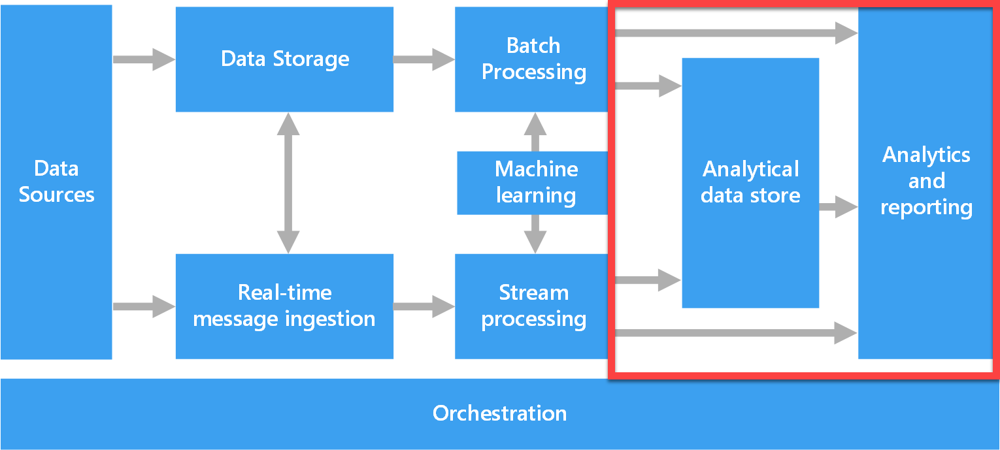

## Microsoft Purview
a unified data-governance service

3 main elements:
- Data Map
- Data Catalog
- Data Estate Insights

### Source data

### Map data:
- Data assets.
- Data lineage.
- Data classifications.
- Business context.

### Scan data: 

- run a scan to access their metadata and browse the asset information.
- A **scan rule set** is a container for grouping scan rules together to use the same rules repeatedly. 

### Classification:
- Government: Attributes such as government identity cards, driver license numbers, and passport numbers.
- Financial: Attributes such as bank account numbers or credit card numbers.
- Personal: Personal information such as a person's age, date of birth, email address, and phone number.
- Security: Attributes like passwords that can be stored.
- Miscellaneous: Attributes not included in the other categories.

### Browse & Search:

Data lineage

## Trusted Data

### Search assets:
- Data Catalog: Contoso catalog
- Asset:
    + overview
    + schema
    + lineage
    + contacts and related assets

### Browse assets
- By Collection
- By source type

Power BI
- Request access to assets
- Build Power BI report
- Scan a Power BI tenant

## Cataglog Artifacts

### Collection

Collections also provide a security boundary for your metadata in the data map. Access to collections, data sources, and metadata is set up and maintained based on the collection’s hierarchy in Microsoft Purview, following a least-privilege model:

- Users have the minimum amount of access they need to do their jobs.
- Users don't have access to sensitive data that they don't need.

### Register & scan data source
#### Register

Each type of data source you choose will require specific information to complete the registration. 

#### Scan
A scan rule set is a container for grouping a set of scan rules together so that you can easily associate them with a scan.

#### Scan data source
Roles & permissions

Permissions in Microsoft Purview are assigned at **collection** level. Collections are used to organize assets and sources and can be thought of as a logical grouping of data assets.

- Data Reader: read only
- Data Curator: able to edit information

## Classify and label data
### Classification rules
The existing classification rules fall under five major categories:

- **Government** - covers attributes such as government identity cards, driver license numbers, passport numbers, etc.
- **Financial** - covers attributes such as bank account numbers or credit card numbers.
- **Personal** - personal information such as a person's age, date of birth, email address, phone number, etc.
- **Security** - attributes like passwords that may be stored.
- **Miscellaneous** - attributes not covered in the other categories.

### Data labels

sensivity labels:

## Search the data catalog
The data catalog can be searched by keyword, object type, collection, classification, contact, label, or assigned term. Results can then be sorted by relevance or name.