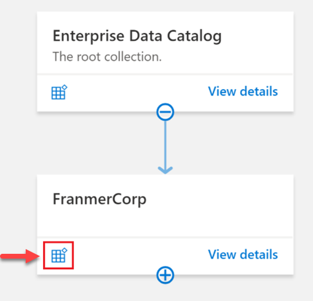

Make data-informed decisions

### Data storage, data ingestion and processing, and data analytics in Azure

*Data ingestion* is the process of **obtaining** and **importing** data for immediate use or storage in an analytical data store.

*Data processing* is the conversion of raw data to meaningful information through a process. Depending on how data is ingested into your system, you could process each data item as it arrives, or buffer the raw data and process it in groups. Processing data as it arrives is called **streaming**. Buffering and processing the data in groups is called **batch processing**.

In **batch processing**, newly arriving data elements are collected into a group. The whole group is then processed at a future time as a batch. Exactly when each group is processed can be determined in many ways.

Azure Synapse: :
SQL, Transact-SQL, Spark...

Power BI:
- provides a platform for secure distribution of dashboards and reports.

DA types: **5** 
- Descriptive analytics: *What* happened?
- Diagnostic analytics: *Why* did it happen?
- Predictive analytics: *What will happen* in the future?
- Prescriptive analytics: *What actions* should be taken?
- Cognitive analytics: *How* can the problem be *solved best*?

Analytics Process: 7 Repitive steps

Types of data/data storage

- Structured Data

