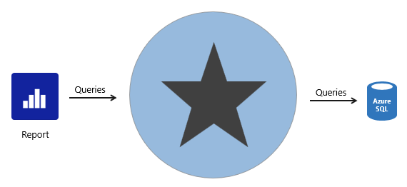
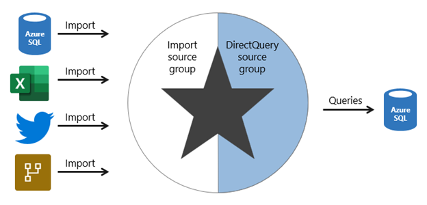

# Unit 

- Data model
- Power BI dataset
- Analytic query
- Tabular model
- Star schema design
- Table storage mode
- Model framework

# 
## Import model
Limitation: 
size: 1gb/dataset

## DirectQuery
Import 
DirectQuery

Enfore low level security

## Composite model

pros
- design flexibility. choose to integrate data using different storage modes, striking the right balance between imported data and pass-through data.

- boost the performance of a DirectQuery model by providing Power BI with opportunity to satisfy some analytic queries from imported data. Querying cached data almost always performs better than pass-through queries.

- you can extend your model with new calculated columns and tables.

cons:
- import
- impact performance 
- break downstream model
- limited relationship

Boost DirectQuery model
- import aggregation model
- dual storage model
- real time data from import model

# Model framework

Most importantly, choose the import model framework whenever possible. This framework offers you the most options, design flexibility, and delivers fast performance. Be sure to apply data reduction techniques to ensure that Power BI loads the least amount of data possible.

Choose the DirectQuery model framework when your data source stores large volumes of data and/or your report needs to deliver near real-time data.

Choose the composite model framework to:

Boost the query performance of a DirectQuery model.
Deliver near real-time query results from an import model.
Extend a Power BI dataset (or AAS model) with additional data.
You can boost the query performance of a DirectQuery model by using aggregation tables, which can use import or DirectQuery storage mode. When using import aggregation tables, be sure to set related dimension tables to use dual storage mode. That way, Power BI can satisfy higher-grain queries entirely from cache.

You can deliver near real-time query results from in import model by creating a hybrid table. In this case, Power BI adds a DirectQuery partition for the current period.

Lastly, you can create specialized models by chaining to a core model by using DirectQuery. This type of development is typically done by a business analyst who extends core models, which IT delivers and supports.

